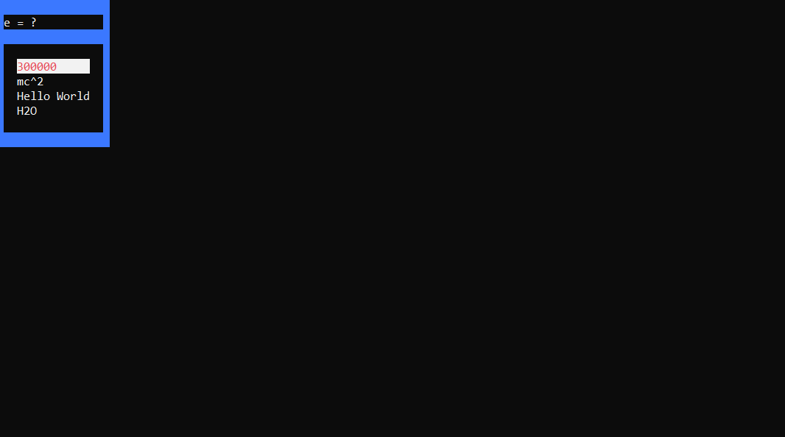

# MyStatV3.0
Creator: Me(MSShift)  

New console based testing system insired by Mystat, link below:  
https://mystat.itstep.org

For this to work on different devices you need to change:    
const fs::path Studentpath to path where this repository is downloaded now (created in questions.h)    
const fs::path Testspath to path where this repository is downloaded now (created in questions.h)

This is preview of test:  
